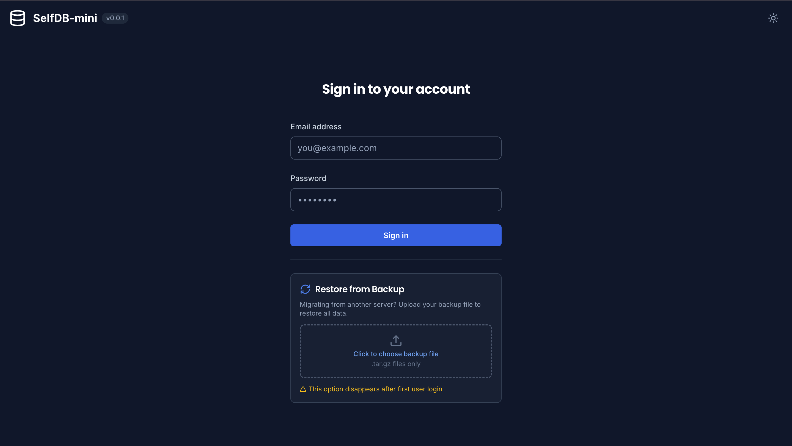
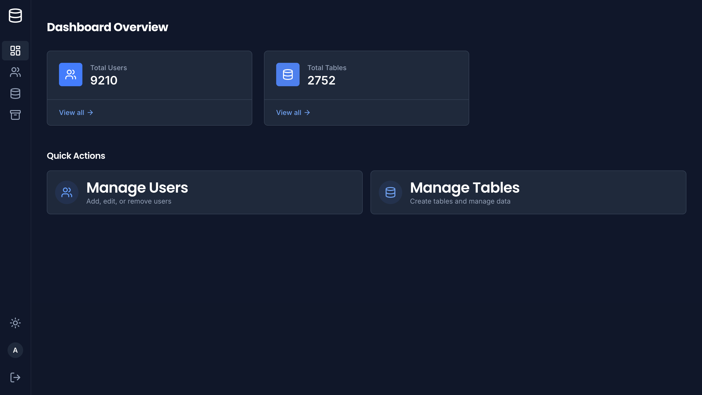
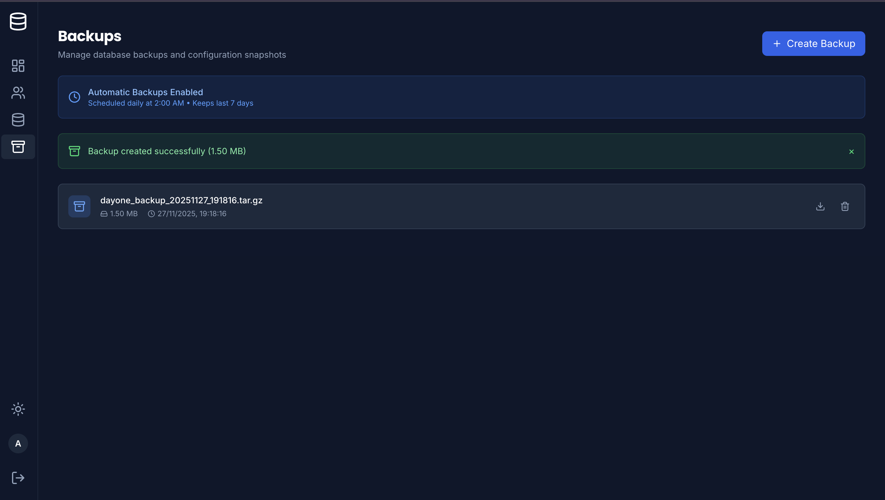
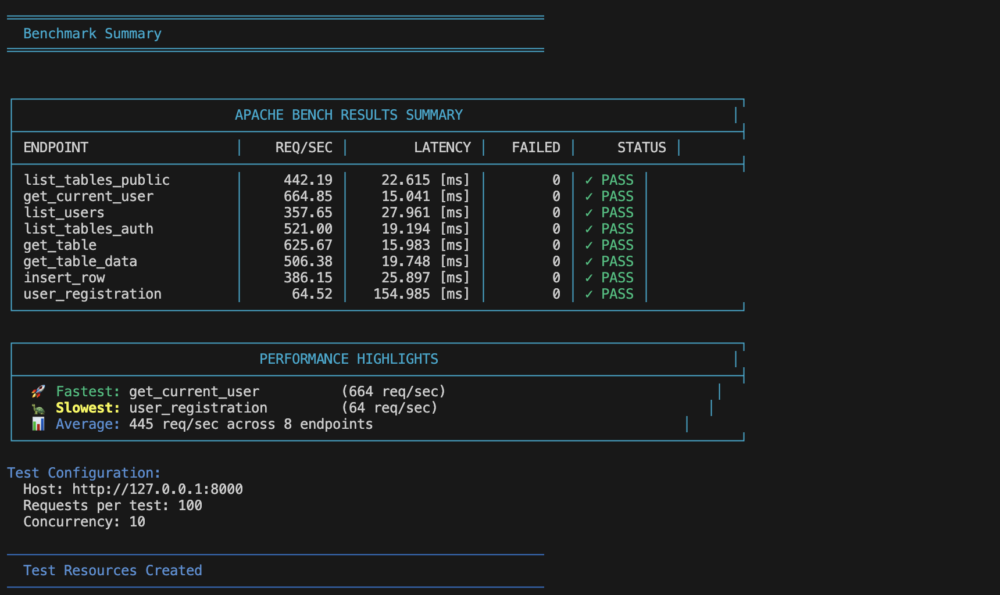
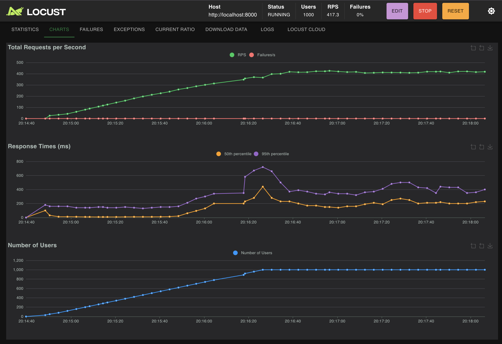
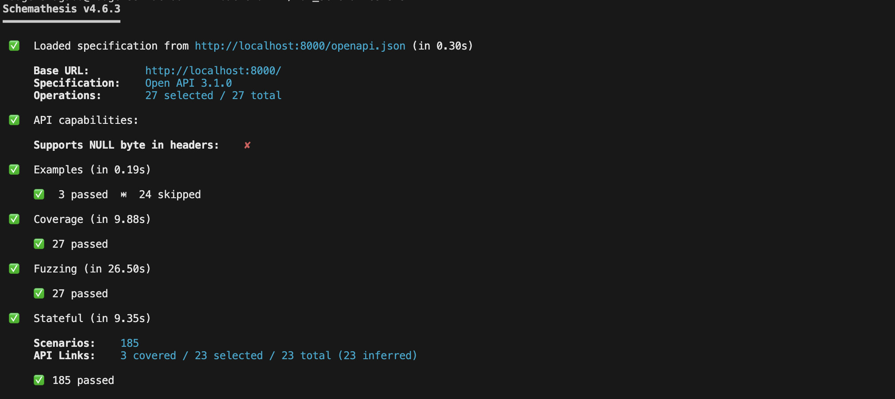

# SelfDB-mini

A minimal implementation of [SelfDB](https://github.com/Selfdb-io) with only the essential features: **FastAPI** backend, **React + TypeScript** frontend, and PostgreSQL database with PgBouncer connection pooling.

## Screenshots












---

## Table of Contents

- [Architecture](#architecture)
- [Prerequisites](#prerequisites)
- [Quick Start](#quick-start)
- [Port Configuration](#port-configuration)
- [Local Development](#local-development-database-in-docker)
- [Docker Commands](#docker-commands)
- [SDK Generation](#sdk-generation)
- [Testing](#testing)
  - [Schemathesis (API Contract Testing)](#schemathesis-api-contract-testing)
  - [Apache Bench (Load Testing)](#apache-bench-load-testing)
  - [Locust (Load Testing)](#locust-load-testing)
- [Backup & Restore](#backup--restore)
  - [Manual Backups (Web UI)](#manual-backups-web-ui)
  - [Scheduled Backups](#scheduled-backups)
  - [CLI Restore](#cli-restore)
  - [Web UI Restore (Fresh Install)](#web-ui-restore-fresh-install)
- [Project Structure](#project-structure)
- [API Documentation](#api-documentation)
- [Contributing](#contributing)
- [License](#license)
- [Learn More](#learn-more)

---

## Architecture

```
┌─────────────────┐     ┌─────────────────┐     ┌─────────────────┐
│                 │     │                 │     │                 │
│  React Frontend │────▶│  FastAPI Backend│────▶│   PostgreSQL    │
│  (Vite + TS)    │     │    (Python)     │     │  + PgBouncer    │
│  Port: 3000     │     │   Port: 8000    │     │  Port: 5433     │
│                 │     │                 │     │                 │
└─────────────────┘     └─────────────────┘     └─────────────────┘
```

---

## Prerequisites

- **Python 3.11+** with [uv](https://docs.astral.sh/uv/) package manager
- **Node.js 18+** with npm or pnpm
- **Docker** and **Docker Compose** (for database)
- **PostgreSQL client** (optional, for direct DB access)

---

## Quick Start

Use the provided setup script to download PgBouncer and start all services:

```bash
# Start all services (downloads PgBouncer, builds, and starts containers)
./setup.sh

# Or explicitly run start command
./setup.sh start

# Stop all services
./setup.sh stop

# Rebuild all services (no cache)
./setup.sh rebuild

# Show help
./setup.sh help
```

**Default ports (configurable via `.env`):**
- **Frontend**: http://localhost:3000
- **Backend API**: http://localhost:8000
- **API Docs**: http://localhost:8000/docs
- **PostgreSQL**: localhost:5433
- **PgBouncer**: localhost:6435

---

## Port Configuration

All external ports are configurable via the `.env` file. Edit the ports to avoid conflicts with other services on your machine:

```env
# Port Configuration (Change these to avoid conflicts)
DB_PORT=5433           # PostgreSQL external port
PGBOUNCER_PORT=6435    # PgBouncer external port
BACKEND_PORT=8000     # Backend API external port
FRONTEND_PORT=3000   # Frontend external port
```

**To change ports:**

1. Edit the `.env` file with your desired ports
2. Run the setup script to apply changes:
   ```bash
   ./setup.sh rebuild
   ```

The setup script will rebuild and restart all services with the new port configuration.

---

## Local Development (Database in Docker)

For development with hot-reload:

### 1. Start the Database (Docker)

```bash
docker compose up -d db pgbouncer
```

### 2. Start the Backend

```bash
cd backend
uv run fastapi dev
```

The API will be available at http://localhost:8000

- **API Docs (Swagger)**: http://localhost:8000/docs
- **API Docs (ReDoc)**: http://localhost:8000/redoc
- **OpenAPI JSON**: http://localhost:8000/openapi.json

### 3. Start the Frontend

```bash
cd frontend
npm install  # or pnpm install
npm run dev  # or pnpm dev
```

The frontend will be available at http://localhost:5173

---

## Docker Commands

```bash
# View logs for a specific service
docker compose logs -f backend

# Execute command in running container
docker compose exec backend uv run python -c "print('hello')"

# View running services
docker compose ps
```

---

## SDK Generation

Generate TypeScript client SDK from the OpenAPI spec for type-safe API calls.

### Recommended: hey-api (Used by Frontend)

```bash
cd backend

# Generate OpenAPI spec first
uv run python -c "from main import app; import json; print(json.dumps(app.openapi()))" > openapi.json

# Generate TypeScript SDK
npx -y @hey-api/openapi-ts \
  -i openapi.json \
  -o ../frontend/src/client \
  -c @hey-api/client-fetch
```

The generated client will be in `frontend/src/client/` with:
- `sdk.gen.ts` - API functions
- `types.gen.ts` - TypeScript types
- `client.gen.ts` - HTTP client configuration

### Alternative: Swagger Codegen (Docker)

Generate SDKs for multiple languages using Swagger Codegen:

**TypeScript:**
```bash
docker run --rm -v ${PWD}:/local \
  swaggerapi/swagger-codegen-cli-v3 generate \
  -i /local/openapi.json \
  -l typescript-fetch \
  -o /local/sdks/swagger-codegen/typescript
```

**Python:**
```bash
docker run --rm -v ${PWD}:/local \
  swaggerapi/swagger-codegen-cli-v3 generate \
  -i /local/openapi.json \
  -l python \
  -o /local/sdks/swagger-codegen/python
```

**Swift:**
```bash
docker run --rm -v ${PWD}:/local \
  swaggerapi/swagger-codegen-cli-v3 generate \
  -i /local/openapi.json \
  -l swift5 \
  -o /local/sdks/swagger-codegen/swift
```

---

## Testing

### Schemathesis (API Contract Testing)

[Schemathesis](https://schemathesis.readthedocs.io/) automatically generates test cases from your OpenAPI schema to find bugs and edge cases.

```bash
cd backend

# Run all API contract tests
./run_schemathesis.sh

# Or run manually with more options
uv run schemathesis run http://localhost:8000/openapi.json \
  --header "X-API-Key: Myapi-Key-for-dev" \
  --checks all \
  --stateful=links

# Generate a test report
uv run schemathesis run http://localhost:8000/openapi.json \
  --header "X-API-Key: Myapi-Key-for-dev" \
  --report
```

**What it tests:**
- ✅ Response schema validation
- ✅ Status code correctness
- ✅ Content-type headers
- ✅ Edge cases (empty strings, nulls, special characters)
- ✅ Stateful testing (API workflow sequences)

### Apache Bench (Load Testing)

[Apache Bench](https://httpd.apache.org/docs/2.4/programs/ab.html) (ab) performs quick HTTP load tests.

```bash
cd backend

# Run with defaults (100 requests, 10 concurrent)
./ab_benchmark.sh

# Custom load test
./ab_benchmark.sh -n 500 -c 25

# Quick smoke test
./ab_benchmark.sh --quick

# Stress test (1000 requests, 100 concurrent)
./ab_benchmark.sh --stress

# Test against different host
./ab_benchmark.sh -h http://api.example.com

# Show help
./ab_benchmark.sh --help
```

**Options:**
| Flag | Description | Default |
|------|-------------|---------|
| `-n, --requests` | Total number of requests | 100 |
| `-c, --concurrency` | Concurrent connections | 10 |
| `-h, --host` | API host URL | http://127.0.0.1:8000 |
| `--quick` | Quick test (50 req, 5 concurrent) | - |
| `--stress` | Stress test (1000 req, 100 concurrent) | - |

**Output includes:**
- Requests per second
- Time per request (latency)
- Failed requests count
- Summary table of all endpoints

### Locust (Load Testing)

[Locust](https://locust.io/) provides a web UI for interactive load testing with realistic user behavior simulation.

```bash
cd backend

# Start Locust with web UI
uv run locust -f locustfile.py --host=http://localhost:8000

# Then open http://localhost:8089 in your browser
```

**Headless mode (CI/CD):**
```bash
# Run for 1 minute with 100 users, spawning 10/second
uv run locust -f locustfile.py \
  --host=http://localhost:8000 \
  --users 100 \
  --spawn-rate 10 \
  --run-time 1m \
  --headless

# Quick smoke test
uv run locust -f locustfile.py \
  --host=http://localhost:8000 \
  -u 10 -r 5 \
  --run-time 30s \
  --headless \
  QuickSmokeTest
```

**User Types:**
| User Class | Description | Weight |
|------------|-------------|--------|
| `AuthenticatedAPIUser` | Full CRUD on all resources | 3 |
| `PublicAPIUser` | Public endpoints only | 1 |
| `QuickSmokeTest` | Rapid-fire test (explicit only) | 0 |

**Web UI Features:**
- Real-time charts (RPS, response times, failures)
- Per-endpoint statistics
- Download test reports
- Adjustable user count during test

---

## Backup & Restore

SelfDB-mini includes a comprehensive backup system for disaster recovery and server migration.

### Backup Overview

| Feature | Description |
|---------|-------------|
| **Storage Location** | `./backups/` folder in project root |
| **Format** | `.tar.gz` archive containing database dump + .env |
| **Scheduling** | Configurable via cron expression |
| **Retention** | Automatic cleanup of old backups |

**What's included in a backup:**
- `database.sql` - Full PostgreSQL database dump
- `.env` - Configuration file snapshot

### Configuration

Set these variables in your `.env` file:

```env
# Backup retention period (days)
BACKUP_RETENTION_DAYS=7

# Backup schedule (cron format: minute hour day month weekday)
# Default: Daily at 2:00 AM
BACKUP_SCHEDULE_CRON=0 2 * * *
```

**Cron Examples:**
| Schedule | Cron Expression |
|----------|-----------------|
| Daily at 2 AM | `0 2 * * *` |
| Every 6 hours | `0 */6 * * *` |
| Weekly on Sunday at 3 AM | `0 3 * * 0` |
| Every 12 hours | `0 0,12 * * *` |

### Manual Backups (Web UI)

1. Login as an **admin user**
2. Navigate to **Backups** page (in sidebar)
3. Click **Create Backup**
4. Download backups directly from the list


### Scheduled Backups

Backups run automatically based on `BACKUP_SCHEDULE_CRON`. The scheduler starts with the backend service.

**View scheduled backup logs:**
```bash
docker compose logs -f backend | grep -i backup
```

**Backup files are stored in:**
```
./backups/
├── dayone_backup_20251127_020000.tar.gz
├── dayone_backup_20251126_020000.tar.gz
└── ...
```

### CLI Restore

For headless servers or when you prefer the command line:

```bash
# List available backups
./restore_from_backup.sh

# Restore the most recent backup
./restore_from_backup.sh latest

# Restore a specific backup
./restore_from_backup.sh dayone_backup_20251127_113057.tar.gz
```

**Example output:**
```
═══════════════════════════════════════════════════════════════
  Day-One Backup Restore Tool
═══════════════════════════════════════════════════════════════

Available backups in ./backups/:

  #  | Filename                              | Size      | Date
-----+---------------------------------------+-----------+-------------------
  1  | dayone_backup_20251127_113057.tar.gz  | 420K      | 2025-11-27 11:30:57
  2  | dayone_backup_20251126_020000.tar.gz  | 415K      | 2025-11-26 02:00:00

Usage: ./restore_from_backup.sh <backup-filename>
       ./restore_from_backup.sh latest    # Restore the most recent backup
```

### Web UI Restore (Fresh Install)

When deploying to a new server, you can restore from backup via the login page:

1. **Fresh install** - Deploy SelfDB-mini to new server (no users exist yet)
2. **Copy backup** - Place your `.tar.gz` backup in the `./backups/` folder
3. **Open login page** - You'll see a "Restore from Backup" option
4. **Upload & restore** - Select your backup file and confirm

> ⚠️ **Note:** The restore option on the login page **disappears after the first user logs in**. This is a security feature to prevent unauthorized data overwrites.

### Backup Storage & SMB Sharing

Backups are stored in `./backups/` which is a local folder mount (not a Docker volume). This makes it easy to:

- **Access directly** - Browse backups in your file manager
- **Set up SMB/NFS share** - Share the `backups/` folder over your network
- **Sync to cloud** - Use rsync, rclone, or cloud sync tools
- **Offsite backup** - Copy to external drives or remote servers

**Example: Sync to remote server:**
```bash
rsync -avz ./backups/ user@backup-server:/backups/dayone/
```

**Example: Sync to S3:**
```bash
aws s3 sync ./backups/ s3://my-bucket/dayone-backups/
```

---

## Project Structure

```
selfdb-mini/
├── docker-compose.yml      # Full stack services
├── README.md               # This file
├── restore_from_backup.sh  # CLI restore tool
├── .env                    # Environment configuration
│
├── backups/                # Backup storage (auto-created)
│   └── dayone_backup_*.tar.gz
│
├── backend/                # FastAPI Backend
│   ├── main.py             # Application entry point
│   ├── db.py               # Database connection
│   ├── security.py         # Authentication & authorization
│   ├── pyproject.toml      # Python dependencies
│   ├── openapi.json        # Generated OpenAPI spec
│   │
│   ├── endpoints/          # API route handlers
│   │   ├── users.py        # User CRUD endpoints
│   │   └── tables.py       # Table/data CRUD endpoints
│   │
│   ├── models/             # Pydantic models
│   │   ├── user.py         # User schemas
│   │   └── table.py        # Table schemas
│   │
│   ├── services/           # Business logic services
│   │   └── backup_service.py # Backup/restore operations
│   │
│   ├── locustfile.py       # Locust load tests
│   ├── ab_benchmark.sh     # Apache Bench tests
│   └── run_schemathesis.sh # API contract tests
│
├── frontend/               # React Frontend
│   ├── src/
│   │   ├── App.tsx         # Main app component
│   │   ├── main.tsx        # Entry point
│   │   │
│   │   ├── client/         # Generated API client (SDK)
│   │   │   ├── sdk.gen.ts  # API functions
│   │   │   └── types.gen.ts# TypeScript types
│   │   │
│   │   ├── components/     # Reusable UI components
│   │   ├── context/        # React context (auth, etc.)
│   │   ├── lib/            # Utilities & constants
│   │   └── pages/          # Page components
│   │
│   ├── package.json        # Node dependencies
│   ├── vite.config.ts      # Vite configuration
│   ├── tailwind.config.js  # Tailwind CSS config
│   └── tsconfig.json       # TypeScript config
│
└── pgbouncer-1.25.0/       # PgBouncer source (for Docker build)
```

---

## API Documentation

When the backend is running, access the interactive API documentation:

| URL | Description |
|-----|-------------|
| http://localhost:8000/docs | Swagger UI (interactive) |
| http://localhost:8000/redoc | ReDoc (read-only) |
| http://localhost:8000/openapi.json | OpenAPI JSON spec |

**Authentication:**
- All requests require `X-API-Key: Myapi-Key-for-dev` header
- Protected endpoints also require `Authorization: Bearer <token>` header
- Get a token via `POST /users/token` with email/password

---

## Contributing

We welcome contributions from the community! Whether it's bug fixes, new features, documentation improvements, or suggestions — all contributions are appreciated.

**How to contribute:**

1. **Fork the repository** - Click the "Fork" button on GitHub
2. **Clone your fork** - `git clone https://github.com/YOUR_USERNAME/selfdb-mini.git`
3. **Create a branch** - `git checkout -b feature/your-feature-name`
4. **Make your changes** - Write code, tests, and documentation
5. **Commit your changes** - `git commit -m "Add: your feature description"`
6. **Push to your fork** - `git push origin feature/your-feature-name`
7. **Open a Pull Request** - Submit your PR with a clear description

**Guidelines:**
- Follow the existing code style and conventions
- Write clear commit messages
- Add tests for new features when applicable
- Update documentation as needed

For major changes, please open an issue first to discuss what you would like to change.

---

## License

This project is licensed under the **MIT License** - see the [LICENSE](LICENSE) file for details.

```
MIT License - Copyright (c) 2025 SelfDB
```

You are free to use, modify, and distribute this software for any purpose.

---

## Learn More

- [FastAPI Documentation](https://fastapi.tiangolo.com)
- [React Documentation](https://react.dev)
- [Vite Documentation](https://vitejs.dev)
- [Tailwind CSS](https://tailwindcss.com)
- [PostgreSQL](https://www.postgresql.org/docs/)
- [PgBouncer](https://www.pgbouncer.org/)
- [Schemathesis](https://schemathesis.readthedocs.io/)
- [Locust](https://locust.io/)
- [hey-api/openapi-ts](https://heyapi.vercel.app/)
